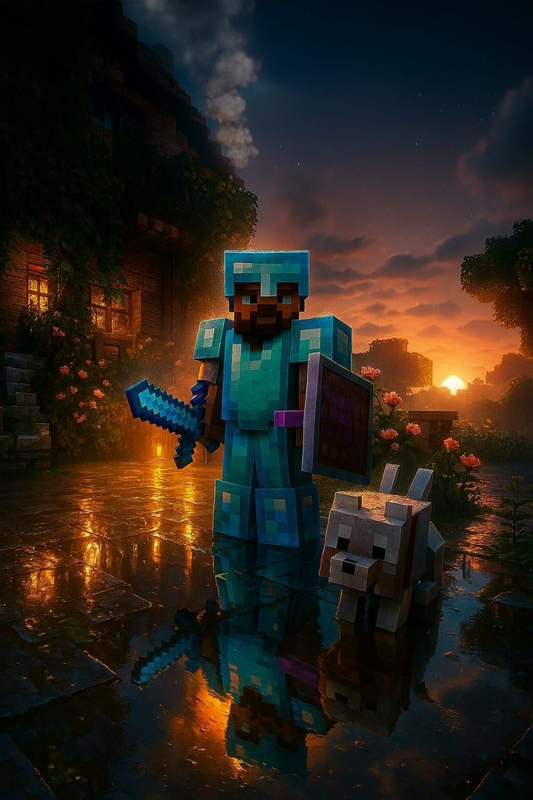

<h1 align="center">Let's brainstorm a better tomorrow  :3</h1>

  

👨‍💻 **About me**

A cat person.

Mid ahh programmer with procastination issues. Love exploring different tech stacks. Never worked with a team, want it so bad ＞﹏＜

😻 **Loves to do**
1. Building and documenting full-stack web projects using modern JavaScript frameworks.
2. Improving Git workflow, including branching, pull requests, and version control best practices.
3. Python Scripting
4. Telegram Bot Development
5. Taking inspirations from fellow developers
6. Maintaining proper Project Structure
7. Caffeine intake

<h3 align="left">Connect with me:</h3>

  

<h3 align="left">Languages and Tools</h3>

  
                   

<h1></h1>
<table>
  <tr>
    <td>
      

    </td>
   <td>
     

   </td>

  </tr>
</table>
 

  

